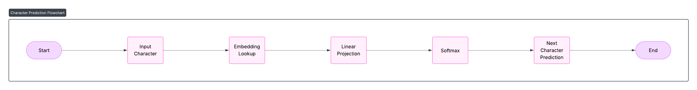

# **GPT-Scratch: Building Character-Level Language Models from Scratch**

## **Abstract**

This project presents the development and analysis of two character-level language models implemented from scratch using PyTorch: a statistical Bigram model and a simplified transformer-based GPT (Generative Pretrained Transformer). The models are trained on Shakespearean text and evaluated on metrics including loss, perplexity, generation quality, and GPU resource usage. The Bigram model provides a fast and intuitive baseline, while the GPT model demonstrates the expressive power of deep learning-based la...

---

## **1. Introduction**

Language modeling is a foundational task in natural language processing (NLP), involving the prediction of the next element in a sequence of tokens. Traditionally, this has included statistical models such as n-grams. More recently, neural architectures like recurrent neural networks (RNNs) and transformers have enabled substantial performance gains in understanding and generating natural language.

This work explores two ends of this modeling spectrum:

- **Bigram Language Model**: a statistical model that uses conditional probabilities of character pairs.
- **Mini GPT**: a transformer-based model that uses multi-head self-attention and positional encoding to model dependencies over longer sequences.

By comparing these models in a controlled, character-level setup, we aim to understand their learning behavior, computational cost, and generation capability.

---

## **2. Dataset and Preprocessing**

The dataset consists of character-level excerpts from Shakespeare’s plays, provided in `miniSpeare.txt`. The preprocessing pipeline includes:

- Building a vocabulary of unique characters.
- Creating mappings from characters to integer IDs and vice versa.
- Converting the full corpus into a tensor of integers.
- Splitting the dataset into training and validation subsets (90/10 split).

Example preprocessing code:

```python
stoi = { ch:i for i,ch in enumerate(chars) }
itos = { i:ch for i,ch in enumerate(chars) }
encode = lambda s: [stoi[c] for c in s]
decode = lambda l: ''.join([itos[i] for i in l])
```

This enables training on tokenized sequences while allowing for easy decoding during inference.

---

## **3. Model Architectures**

### **3.1 Bigram Model**

The Bigram model is a direct implementation of a conditional probability table for character pairs.



 It is implemented using an embedding table of shape `(vocab_size, vocab_size)` where each character maps directly to logits over possible next characters. Training is done via cross-entropy loss.

**Training Loop**

```python
for iter in range(max_iters):
    xb, yb = get_batch('train')
    logits, loss = model(xb, yb)
    optimizer.zero_grad()
    loss.backward()
    optimizer.step()
```

**Key Characteristics:**

- No notion of context beyond one preceding character.
- Fast to train, but unable to learn patterns beyond simple co-occurrences.

**Key Implementation**

```python
class BigramLanguageModel(nn.Module):
    def __init__(self, vocab_size):
        super().__init__()
        self.token_embedding_table = nn.Embedding(vocab_size, vocab_size)

    def forward(self, idx, targets=None):
        logits = self.token_embedding_table(idx)
        if targets is None:
            loss = None
        else:
            B, T, C = logits.shape
            logits = logits.view(B*T, C)
            targets = targets.view(B*T)
            loss = F.cross_entropy(logits, targets)
        return logits, loss
```

### **3.2 Mini GPT Model**

The Mini GPT model is a compact version of the GPT architecture. 


It includes:

- Token and positional embeddings.

**Embedding Tables**

```python
self.token_embedding_table = nn.Embedding(vocab_size, n_embd)
self.position_embedding_table = nn.Embedding(block_size, n_embd)
```

- Stacked transformer blocks with multi-head self-attention.

**Transformer Block**

```python
class Block(nn.Module):
    def forward(self, x):
        x = x + self.sa(self.ln1(x))
        x = x + self.ffwd(self.ln2(x))
        return x
```

**Self-Attention Head**

```python
class Head(nn.Module):
    def forward(self, x):
        B, T, C = x.shape
        k = self.key(x)
        q = self.query(x)
        wei = q @ k.transpose(-2, -1) * C**-0.5
        wei = wei.masked_fill(tril == 0, float('-inf'))
        wei = F.softmax(wei, dim=-1)
        out = wei @ self.value(x)
        return out
```

- Feedforward networks and layer normalization.

**Key Features:**

- Capable of modeling long-range dependencies.
- Learns contextual representations of character sequences.
- Trained end-to-end with teacher forcing via cross-entropy loss.

The model’s depth and attention mechanisms allow it to learn syntax, speaker structure, and sequence rhythm, which are evident in the generated outputs.

**GPT Model**

```python
class GPTLanguageModel(nn.Module):
    def __init__(self):
        self.blocks = nn.Sequential(*[Block(...) for _ in range(n_layer)])
        self.ln_f = nn.LayerNorm(n_embd)
        self.lm_head = nn.Linear(n_embd, vocab_size)
```

---

## **4. Training Setup**

Training was conducted on a system equipped with an NVIDIA RTX 3060 GPU. PyTorch 2.7.0 with CUDA 11.8 was used for implementation. Models were trained using the AdamW optimizer with the following parameters:

| Parameter | Value |
| --- | --- |
| Steps | 5000 |
| Batch size | 64 |
| Block size | 256 |
| Embedding dim | 384 |
| Attention heads | 6 |
| Layers | 6 |
| Optimizer | AdamW |
| Learning rate | 3e-4 |
| Evaluation | Every 500 steps |
| Device | CUDA (RTX 3060) |

```python
batch_size = 64
block_size = 256
max_iters = 5000
learning_rate = 3e-4
eval_interval = 500
n_embd = 384
n_head = 6
n_layer = 6
dropout = 0.2
```

This setup provides a balance between model expressiveness and training efficiency.

---

## **5. Results and Evaluation**

### **5.1 Loss Curves**

Loss was computed every 500 steps on both training and validation sets.


The Bigram model converges quickly but plateaus at a higher loss. The GPT model demonstrates continued loss reduction over time, indicating deeper pattern learning.

### **5.2 Perplexity**

Perplexity, a measure of model uncertainty, was computed from the cross-entropy loss.


The GPT model shows a substantially lower perplexity, affirming its ability to predict characters more confidently.

### **5.3 GPU Memory Usage**


Memory allocation reflects model depth and batch sizes. The GPT model consistently uses more memory due to its multiple layers and attention mechanisms.

---

## **6. Comparison**

| Feature | Bigram Model | Mini GPT Model |
| --- | --- | --- |
| Context Length | 1 character | Up to 256 characters |
| Architecture | Embedding-only | Deep Transformer |
| Training Speed | Very Fast | Moderate |
| Output Realism | Low (Repetitive) | High (Fluent and Structured) |
| Application | Baseline | Scalable and extensible |

---

## **7. Qualitative Evaluation: Text Generation**

### **Bigram Model Output**

```
Tetereee tteh ete se s rtdtoeeseh:
```

- Character repetition and nonsensical structure are common.
- No long-term coherence or grammatical alignment.

### **GPT Model Output**

```
First Citizen:
I speak to you as men and not as beasts. Have you not suffered?
All:
Aye! Aye!
```

- Recognizable structure resembling a Shakespearean scene.
- Speaker labels, punctuation, and word flow are coherent.

This demonstrates the advantage of contextual modeling using transformers.

---

## **8. Conclusion**

This study highlights the contrast between a statistical Bigram model and a neural transformer-based GPT model in the domain of character-level language modeling.

- The **Bigram model** provides a computationally cheap but limited baseline.
- The **GPT model**, although more resource-intensive, produces significantly better outputs in terms of structure and meaning.
- GPU acceleration, especially using a consumer-grade RTX 3060, enables practical training of deep models in under an hour.

---

## **Appendix**

- **Source Code**: [GitHub Repository](https://github.com/ArnavKucheriya/GPT-Scratch)
- **Notebook Files**: Contain full training and evaluation code for both models.
- **Environment**: Python 3.11, PyTorch 2.7.0+cu118, CUDA 11.8

---
